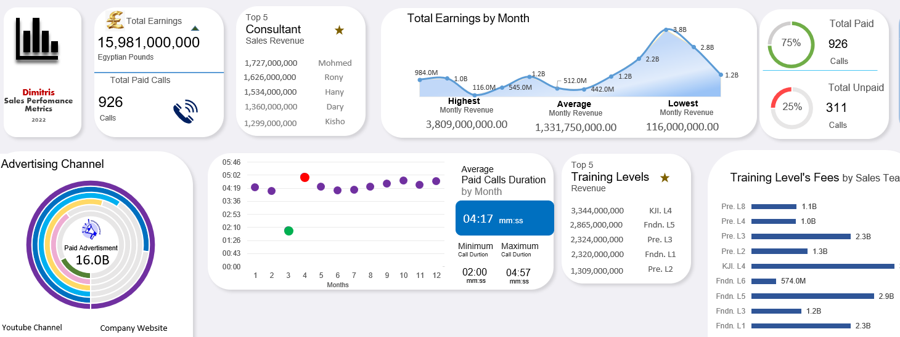
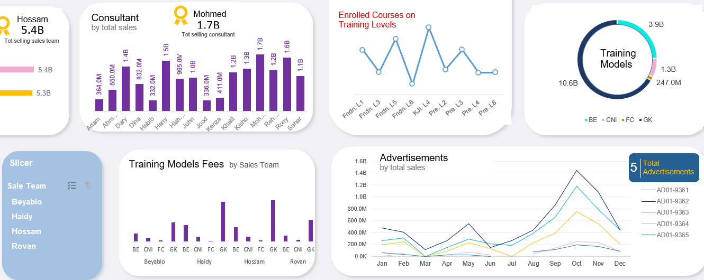

# Sales Analytics Dashboard


> An end-to-end business intelligence project for an online
> education & training provider — 1,239 student records,
> 14 KPIs, interactive dashboards.

## Overview
This project transforms raw sales and enrollment data into
a fully interactive analytics suite covering revenue trends,
advertising channel performance, consultant rankings, and
fee collection analysis.

## Dashboard Preview



## Tools & Technologies
| Tool | Purpose |
|------|---------|
| Microsoft Excel | Pivot tables, KPI cards, charts |
| Power BI | Real-time interactive reports |
| MySQL | Centralised relational database |
| GitHub | Version control & collaboration |

## Dataset
- **Records:** 1,239 student enrollments
- **Dimensions:** Fee status, advertising channel, training
  model, sales team, consultant, area code, enrolled courses
- **Advertising channels:** Television, Facebook, WhatsApp,
  Google Ads, Company Website, YouTube

## Key Metrics
- Total revenue tracked across 12 months
- 74.8% fee collection rate (926 paid / 313 not paid)
- Top training model: GK (57% of students)
- Top ad channel by revenue: Television (4,590M)

## Project Structure
```
excel-sales-dashboard/
├── excel/          # Dashboard.xlsx + Raw_Data.xlsx
├── images/         # Dashboard screenshots
├── sql/            # MySQL schema and scripts
├── docs/           # Business proposal
└── README.md
```

## How to Use
1. Clone the repo: `git clone https://github.com/your-username/excel-sales-dashboard`
2. Open `excel/Sales_Analytics_Dashboard.xlsx` in Excel
3. Enable macros if prompted for data refresh
4. For Power BI: import `excel/Raw_Data.xlsx` into Power BI Desktop

## License
MIT — free to use and adapt with attribution.